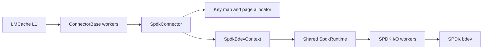
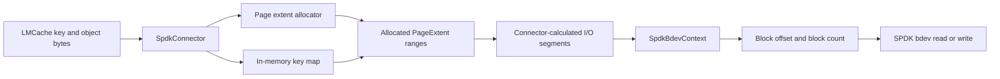
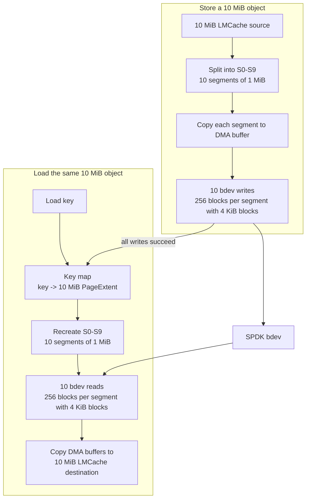
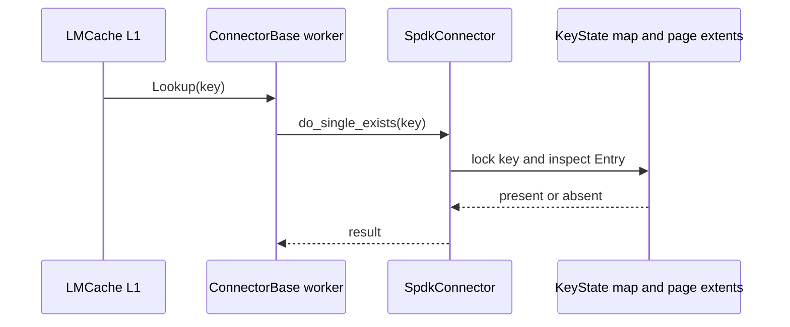
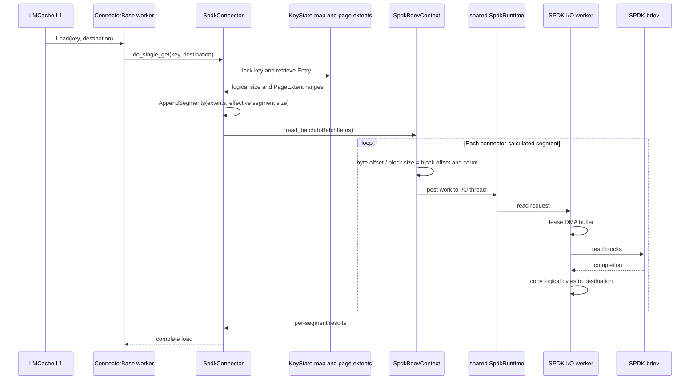
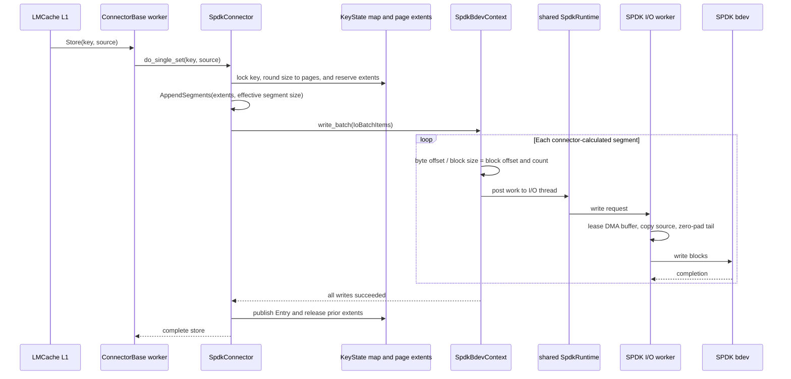

# Architecture

`lmcache-spdk-connector` translates LMCache's keyed-object interface into
asynchronous block I/O.

LMCache submits a key and a byte buffer; an SPDK bdev
accepts only a block offset, block count, and DMA-compatible buffer.

The connector owns the metadata and scheduling needed to bridge those models.

## Components and Ownership

Each `SpdkConnector` uses a `SpdkBdevContext` for one bdev. The context owns
that bdev's descriptor, bdev channels, I/O workers, and DMA buffer pools.

Contexts in the same LMCache process share one `SpdkRuntime`. The runtime owns
SPDK initialization and the reactor threads, avoiding a separate SPDK runtime
for every connector instance.

## CPU and Thread Ownership

`connector_worker_cpus` and `spdk_reactor_cpus` must be CPU
sets that do not overlap.

- ConnectorBase workers prepare LMCache I/O metadata and requests
- SPDK reactors, bdev channels, and I/O workers run on the
reactor CPUs.
- Separating these sets prevents connector work from contending with the
polling threads that drive SPDK completions.

`spdk_io_thread_count` selects the number of bdev channel owners.

## Bridging LMCache Objects to SPDK bdev I/O

SPDK does not allocate capacity for an LMCache key or 'remember' where that key
is stored.

The connector provides that bridge with an in-memory mapping from
each key to its logical size and allocated `PageExtent` ranges.

On Store, `SpdkConnector` rounds the object size up to storage pages and
reserves one or more page extents. Multiple page extents allow variable-size objects
to be read/written to a bdev, and take the role of an allocator that allows re-use of space
after deletes or replacements, even with fragmentation.

A scenario with variable-sized objects could occur if multiple inference engine instances (vLLM, SGLang..)
are running on top of a single LMCache instacnce, with each specifying different KV cache block sizes.

The variable-size allocator could be potentially replaced by fixed-slot allocator, and would match the
current behavior of the `raw_block` LMCache adapter, but this remains an open item in the current implementation.

## Page Translation and Segmented I/O

The effective segment size is `spdk_io_segment_bytes`, capped by the bdev's
maximum read or write size and rounded to full storage pages.

For example, a 10 MiB object stored in one contiguous extent with a 1 MiB
effective segment size becomes ten 1 MiB segments. For each segment,
`SpdkBdevContext` converts the connector-calculated byte offset and length to a
bdev block offset and block count, then submits one block I/O. With 4 KiB bdev
blocks, each 1 MiB segment is 256 blocks.

The Store writes all ten segments before publishing the key-to-extent entry.
Load retrieves that entry, recreates the same ten segments, and reads them into
DMA buffers before copying the object into LMCache's destination buffer.

## DMA Staging Buffers

LMCache L1 memory buffers are not guaranteed to meet DMA
allocation and alignment requirements by specific bdev.

Each I/O worker therefore
owns a pool of `spdk_dma_zmalloc` bounce buffers used to copy LMCache L1 data
before passing it to LMCache Each buffer is sized to one
effective segment.

For a Store, the worker copies the source bytes into a leased DMA buffer and
zero-pads a partial final page before issuing the write. For a Load, it reads
into a DMA buffer and copies only logical bytes to the destination. There is no
zero-copy path today.

## Operation Flows

### Lookup

Lookup does not perform bdev I/O. It checks whether the in-memory key map has a
published entry for the key.

### Load

Load retrieves the published logical size and extent list, builds segments, and
reads each physical segment through the owning bdev context. Completion copies
the logical bytes from DMA staging buffers to LMCache's destination buffer.

### Store

Store reserves pages before submitting writes, but does not publish the new
entry until all segments complete successfully. This prevents Lookup or Load
from observing a partially written object. Once the entry is published, the
previous entry's extents can be returned to the allocator.

