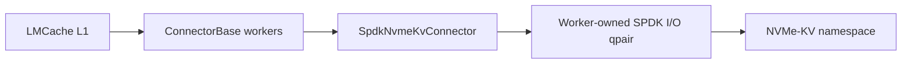
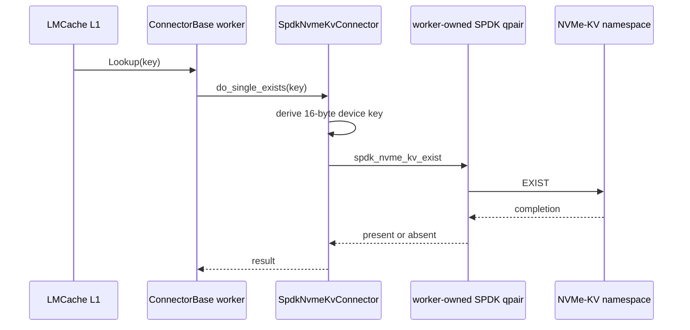
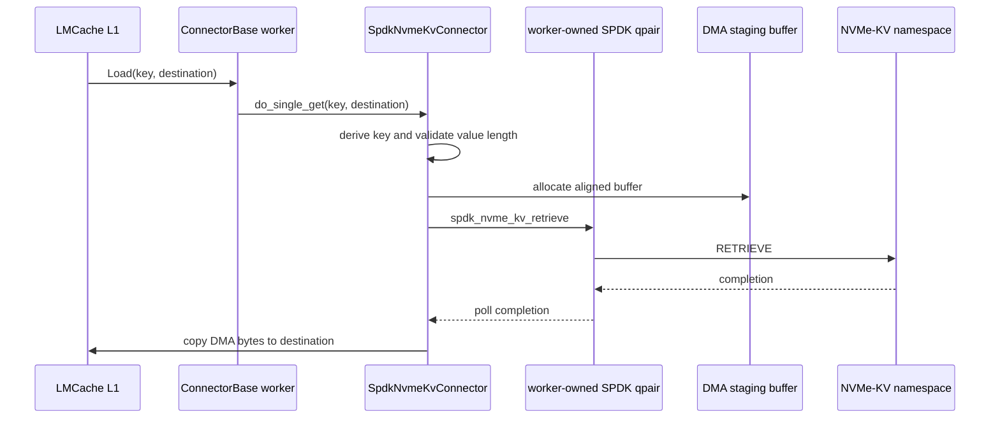
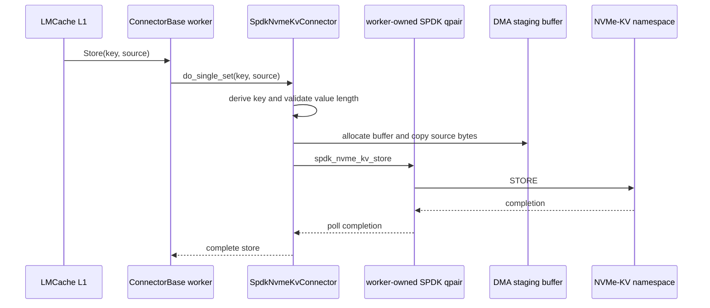

# Architecture

`lmcache-spdk-connector-kv` translates LMCache's keyed-object operations into
the NVMe Key-Value command set. Unlike the bdev connector, it initializes the
SPDK environment, attaches the controller, and submits commands directly to an
NVMe-KV namespace. It does not use bdev JSON configuration or the SPDK bdev
API.

## Components and Ownership

The connector owns the process-wide SPDK environment, the PCIe controller, and
the selected NVMe-KV namespace. `SpdkNvmeKvConnector` extends
`ConnectorBase<KvConnection>`; each ConnectorBase worker receives a
`KvConnection` containing one independently allocated SPDK I/O qpair.

## Environment and Controller Lifecycle

At construction, the connector initializes `spdk_env` using
`hugepage_memory_mb`, probes the configured `pci_bdf` over PCIe, and selects
the first active namespace that reports the NVMe Key-Value command set. It
rejects a namespace that cannot support a 16-byte key or has no nonzero maximum
value length, and records the selected format's `kvvml` as the value limit.

SPDK environment state is process-global. The connector allows only one
NVMe-KV connector per process for this POC.

## Worker-Owned I/O

`num_workers` controls the number of ConnectorBase workers and I/O qpairs.
Each worker exclusively submits commands through and polls completions from its
own qpair. This avoids sharing a qpair between workers and lets each worker
drive its own command completion loop with
`spdk_nvme_qpair_process_completions`.

Store and Load allocate a 4 KiB-aligned `spdk_dma_zmalloc` staging buffer for
each operation. Store copies source bytes into that buffer before submission;
Load copies retrieved bytes from it into LMCache's destination buffer after a
successful completion. There is no zero-copy path.

## Key and Value Translation

An LMCache key is not sent directly to the device. The connector prepends its
key domain, computes SHA-256, and uses the first 16 bytes as the NVMe-KV device
key. Domain separation prevents this connector's device keys from overlapping
with keys derived by another domain using the same source key.

The native proof of concept maps one LMCache object to one device value. Store
and Load reject zero-length values and values larger than the namespace-reported
`kvvml` maximum. Objects are not segmented, so supporting larger objects would
require a multi-value layout and additional metadata.

## Command Flows

### Lookup

Lookup derives the device key and sends an NVMe-KV `EXIST` command. The command
completion determines whether LMCache observes the key as present.

### Load

Load validates the requested length against `kvvml`, derives the device key,
and retrieves the device value into an aligned DMA buffer. The worker polls its
qpair until completion, then copies the requested bytes to LMCache's destination
buffer.

### Store

Store validates the value length and copies the source into an aligned DMA
buffer before sending an NVMe-KV `STORE` command. The operation completes only
after the worker has polled a successful device completion.

